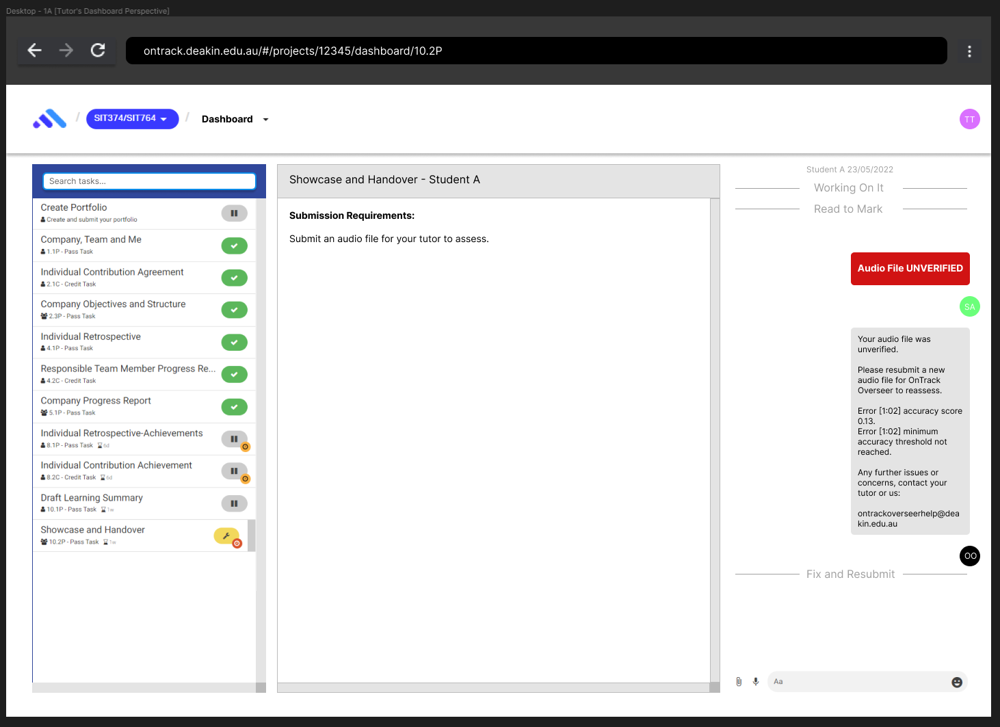
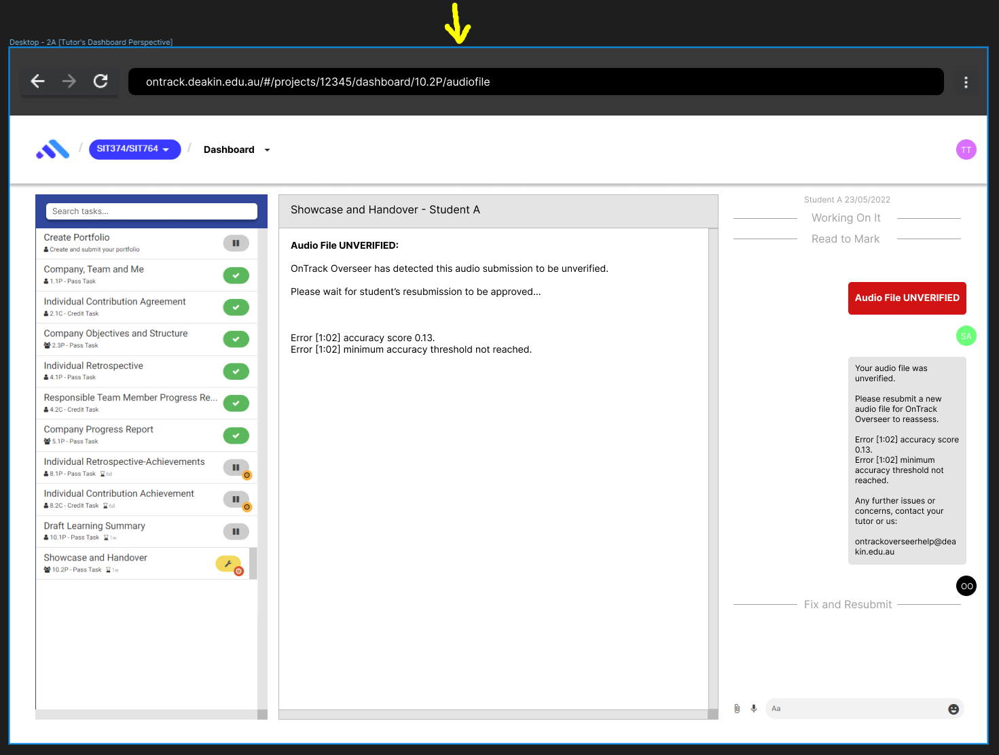
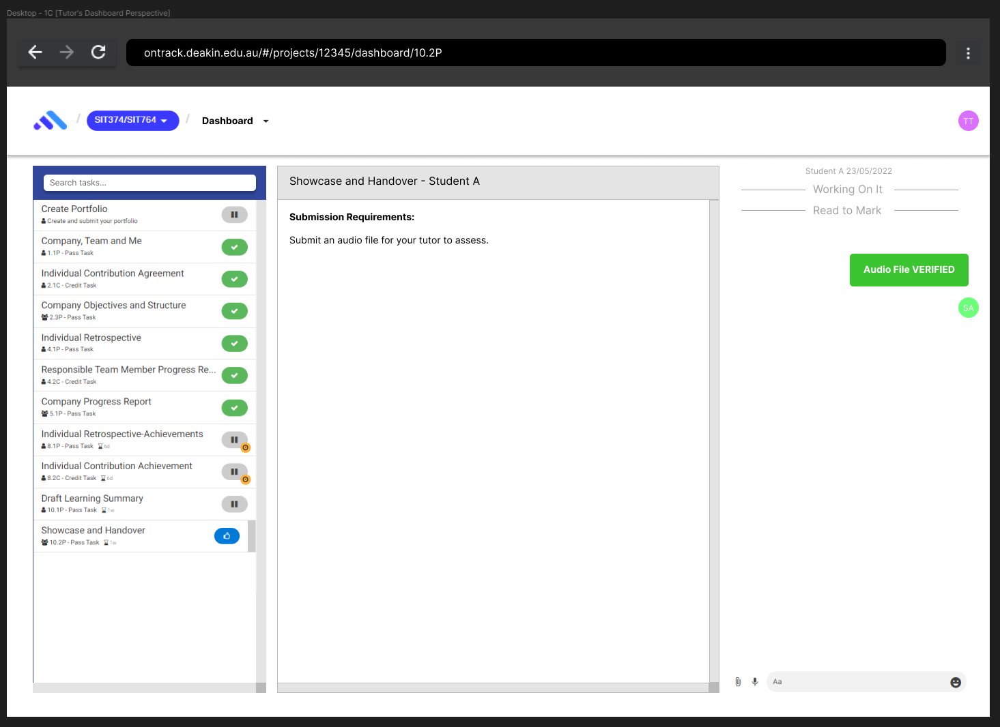

# **Audio System Interface Design Document**

# **Author Information**

- Author: Simon Agahi
- Team: OnTrack – Voice Verification
- Team (Delivery and/or Product) Lead: Shae Christmas

# **Document Summary**

- Documentation Title: Audio System Interface Design Document
- Documentation Type: Technical
- Documentation Information Summary: Design document detailing the implementation of the OnTrack Voice Verification audio system interface, showcased by wireframes for frontend development. Interface to allow tutors to see the results from the voice verification test with the new OnTrack Overseer system as well. The perspective is from a tutor’s as they are the only ones who will have access to it.

# **Document Review Information**

- Date of Original Document Submission to GitHub: 26/09/2022
- Documentation Version: 1.0
- Date of Previous Documentation Review: 26/09/2022
- Date of Next Documentation Review: to be decided

# **Key Links/Resources**

- <https://github.com/thoth-tech/doubtfire-overseer>
- <https://github.com/thoth-tech/doubtfire-web>
- <https://github.com/thoth-tech/doubtfire-api>
- <https://github.com/thoth-tech/speaker-verification>
- <https://github.com/thoth-tech/speaker-verification-api>
- <https://github.com/thoth-tech/documentation/blob/main/docs/OnTrack/Documentation/OnTrack%20Documentation%20Template.md>
- <https://github.com/thoth-tech/documentation/blob/main/docs/OnTrack/Documentation/OnTrack-Documentation-Template-Guide.md>
- <https://github.com/thoth-tech/documentation/blob/main/docs/OnTrack/Voice%20Verification/Voice%20Verification%20SRS%20Document.md>

# **Contacts for further information**

See <https://github.com/thoth-tech/handbook/blob/main/README.md> .

# **Low Fidelity Designs**

\
**Figure 1** below shows the initial sketches and brainstorming put into place for the tutor’s interface when accessing the voice verification results.
\
\

\
\
**Figure 2** below shows a digital draft design for the flowchart between the three different results and visualisations I had sketched in figure 1 earlier. The visualisations are shown for the results and similar conventions that I would use for them to be displayed, while then branching off to the main processes that would subsequently become an output from clicking on these results.
\
\

# **High Fidelity Designs**

\
**Figures 3 and 4** below shows the process and results when the tutor clicks on an audio file that has been unverified from the OnTrack Overseer system.
\
\

\
\
**Figures 5 and 6** below shows the process and results of when the tutor clicks on an audio file that is still pending and hasn’t finished the OnTrack Overseer process yet.
\
\

\
\
**Figures 7 and 8** shows the process and results of when the tutor clicks on an audio file that has completed the OnTrack Overseer process and has established the audio file as being verified.
\
\

